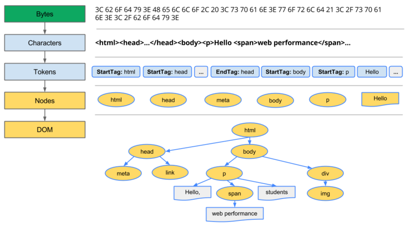
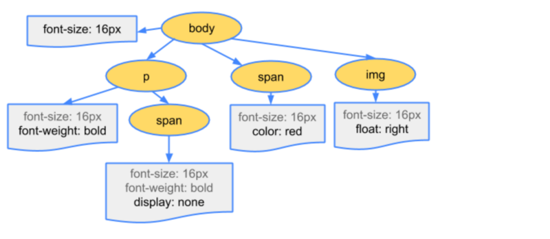
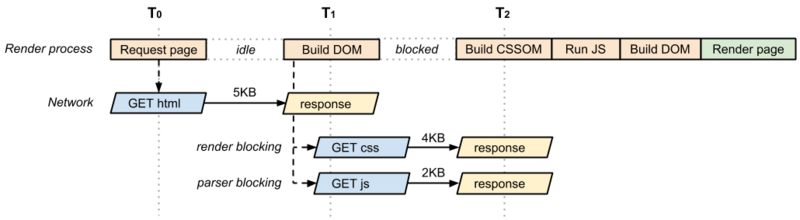
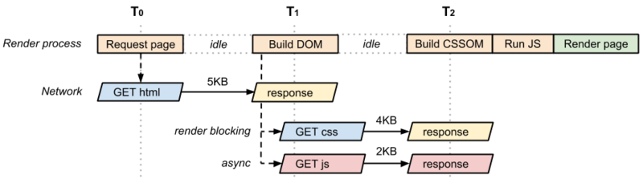

- [页面渲染过程解析](#%E9%A1%B5%E9%9D%A2%E6%B8%B2%E6%9F%93%E8%BF%87%E7%A8%8B%E8%A7%A3%E6%9E%90)
  - [为什么做优化](#%E4%B8%BA%E4%BB%80%E4%B9%88%E5%81%9A%E4%BC%98%E5%8C%96)
  - [怎么做优化](#%E6%80%8E%E4%B9%88%E5%81%9A%E4%BC%98%E5%8C%96)
    - [一、了解浏览器关键渲染路径（html加载过程）](#%E4%B8%80%E4%BA%86%E8%A7%A3%E6%B5%8F%E8%A7%88%E5%99%A8%E5%85%B3%E9%94%AE%E6%B8%B2%E6%9F%93%E8%B7%AF%E5%BE%84html%E5%8A%A0%E8%BD%BD%E8%BF%87%E7%A8%8B)
    - [二、javascript对渲染的影响和降低影响的策略](#%E4%BA%8Cjavascript%E5%AF%B9%E6%B8%B2%E6%9F%93%E7%9A%84%E5%BD%B1%E5%93%8D%E5%92%8C%E9%99%8D%E4%BD%8E%E5%BD%B1%E5%93%8D%E7%9A%84%E7%AD%96%E7%95%A5)
    - [三、image对首屏渲染的影响](#%E4%B8%89image%E5%AF%B9%E9%A6%96%E5%B1%8F%E6%B8%B2%E6%9F%93%E7%9A%84%E5%BD%B1%E5%93%8D)
    - [四、如果js修改了dom或者css会发生什么](#%E5%9B%9B%E5%A6%82%E6%9E%9Cjs%E4%BF%AE%E6%94%B9%E4%BA%86dom%E6%88%96%E8%80%85css%E4%BC%9A%E5%8F%91%E7%94%9F%E4%BB%80%E4%B9%88)
  - [如何评估关键渲染路径](#%E5%A6%82%E4%BD%95%E8%AF%84%E4%BC%B0%E5%85%B3%E9%94%AE%E6%B8%B2%E6%9F%93%E8%B7%AF%E5%BE%84)
  - [怎样做好优化呢？](#%E6%80%8E%E6%A0%B7%E5%81%9A%E5%A5%BD%E4%BC%98%E5%8C%96%E5%91%A2)
  - [总结](#%E6%80%BB%E7%BB%93)
- [前端性能优化知识点汇总](#%E5%89%8D%E7%AB%AF%E6%80%A7%E8%83%BD%E4%BC%98%E5%8C%96%E7%9F%A5%E8%AF%86%E7%82%B9%E6%B1%87%E6%80%BB)
  - [面试必谈的--前端性能优化](#%E9%9D%A2%E8%AF%95%E5%BF%85%E8%B0%88%E7%9A%84--%E5%89%8D%E7%AB%AF%E6%80%A7%E8%83%BD%E4%BC%98%E5%8C%96)
    - [为什么要优化](#%E4%B8%BA%E4%BB%80%E4%B9%88%E8%A6%81%E4%BC%98%E5%8C%96)
    - [有哪些差的体验](#%E6%9C%89%E5%93%AA%E4%BA%9B%E5%B7%AE%E7%9A%84%E4%BD%93%E9%AA%8C)
    - [优化方案大概分为一下几种：](#%E4%BC%98%E5%8C%96%E6%96%B9%E6%A1%88%E5%A4%A7%E6%A6%82%E5%88%86%E4%B8%BA%E4%B8%80%E4%B8%8B%E5%87%A0%E7%A7%8D)
- [回流](#%E5%9B%9E%E6%B5%81)
- [重绘](#%E9%87%8D%E7%BB%98)
- [注意](#%E6%B3%A8%E6%84%8F)


## 页面渲染过程解析

原文链接：https://segmentfault.com/a/1190000015019450

### 为什么做优化

>经典问题：白屏时间过长，用户体验差
>
>产生的原因：网络问题、关键渲染路径（CRP）问题

### 怎么做优化

如何做好优化呢，网上随便一搜，就有很多优化总结，无非就是网络优化，静态资源（html、js、css、image）优化。下面我们撇开网络方面的优化，只分析静态资源方面的优化。而静态资源的优化关键在于你要深入理解**关键渲染路径（CRP）**的运行原理和规则。

#### 一、了解浏览器关键渲染路径（html加载过程）

> 面试必问：
>
> 1. 描述一下从url输入到页面展示的全过程？
>
> 2. 描述一下html加载全过程？
>
>    如何准确回答类似上面的问题呢，那么我们就需要全面了解浏览器关键渲染路径了，了解工作原理，我们才能更好的更深入的理解静态资源的优化方案。

渲染的关键路径分为一下五步

- 构建DOM树

  ```
  构建过程：Bytes->Characters->Tokens->Nodes->Dom
  ```



- 构建CSSOM树

```
构建过程：Bytes->Characters->Tokens->Nodes->CSSOM
```



- 合并DOM树和CSSOM树构建渲染树

1. 过滤掉不可见节点(脚本标记、元标记)
2. 过滤掉样式隐藏的节点（display:none）

- 根据渲染树来布局，计算节点的几何信息（layout）

- 将各个节点绘制在屏幕上（paint）


首先从上面五步中看出，只有当DOM树和CSSOM树都构建完成之后才可以进行渲染树的构建，所以这两步是对整体渲染起到阻塞作用的，当然了DOM树是必须的，它提供了页面内容，而CSSOM的必要性并不是太明显，所以CSSOM构建的过程中可以做一些优化。在做优化前先要了解这几个知识点。

1. 默认情况下，CSS是阻塞渲染的资源

2. 我们可以通过媒体查询和媒体类型把一部分CSS标记为不阻塞渲染（媒体查询的不足就是会严重影响关键渲染路径的性能）

   ```html
   <link href="style.css" rel="stylesheet">
   <link href="print.css" rel="stylesheet" media="print">
   <link href="other.css" rel="stylesheet" media="(min-width: 40em)">
   ```

3. 浏览器会下载所有的CSS资源，无论阻塞还是不阻塞

   >根据上面三个知识点，会让你很清晰的知道，CSS优化可以做的事情就是，根据不同CSS使用场景和优先级的不同进行不阻塞标记。
   >
   >如果必要的CSS就请尽早加载
   >
   >1. 引用位置靠前
   >2. 减小文件体积到客户端，这样就减少了对首次渲染的阻塞

#### 二、javascript对渲染的影响和降低影响的策略

首先我们来讨论下javascript。它可以修改网页的方方面面，内容、样式、以及响应用户的交互。不过，JavaScript也会阻止DOM的构建和延缓网页渲染。下面我们来了解一下JavaScript和DOM、CSSOM的依赖关系。

- JavaScript能修改内容和样式

- 无论（内联JavaScript还是外部JavaScript文件）都会阻止DOM的构建

  **DOM构建过程中如果遇到（非异步加载async）的JavaScript标签，浏览器会终止DOM渲染，立即执行JavaScript。这就是为什么非异步执行的JavaScript要放在尾部或者放在DOMContentLoaded回调中。因为如果该JavaScript代码操作了未构建完的DOM节点就会无法获取该节点而无法执行响应的操作。**

- CSSOM的构建影响javascript的执行

  **如果浏览器尚未完成CSSOM的下载和构建时，去运行JavaScript脚本，那么浏览器会延迟脚本的执行和DOM的构建，直至完成CSSOM的下载和构建。可以这样理解，当出现非异步加载的JavaScript时，CSSOM构建完成时间是早于JavaScript的执行，两者早于DOMContentLoaded（即DOM构建彻底完成）。**

- ##### 未优化--javascript正常加载



- ##### 优化后--javascript异步加载



> 根据上面的分析，我们可以清楚的认识到，非必要优先加载的js，选择**异步加载**是最优选择。


#### 三、image对首屏渲染的影响

> 图像不会阻止首屏的渲染，但是为了增加用户体验我们应该考虑加载适当大小的图片，加速图片的呈现。


#### 四、如果js修改了dom或者css会发生什么

> 只能重新执行一遍渲染流程。就是我们常说的重绘。


### 如何评估关键渲染路径

前面的内容让我们了解了关键路径渲染的基本原理和可能优化的机会，下面我们就需要使用一些工具，帮助我们去评估现有页面的CRP性能。

- 测试工具：Lighthouse 可以快速测试你的网页，并提供性能报告
- 监控工具：Nivigation Timing Api 设置你的代码，实时监控用户使用过程中的性能。


### 怎样做好优化呢？

> 请移步[性能优化汇总](https://segmentfault.com/a/1190000013363147)


### 总结

JavaScript阻止DOM构建（DOMContentLoaded触发被延迟），css的下载和完成阻止javascript的执行。在没有JavaScript或者只含有异步JavaScript的页面，DOM的构建和CSSOM的构建互不影响。


## 前端性能优化知识点汇总

原文链接： https://segmentfault.com/a/1190000013363147

### 面试必谈的--前端性能优化

#### 为什么要优化

> 提供用户最佳的体验

#### 有哪些差的体验

- 白屏好久才显示内容
- h5浪费用户流量


#### 优化方案大概分为一下几种：

1. 降低请求数量
   - 减少获取数据的接口数（初始数据尽量通过一个数据返回）
   - 减少js，css的数量（提取公共js、css利用缓存、减少后续加载访问）
   - 图片懒加载

2. 降低文件大小
   - 图片压缩以及使用webp
   - 压缩js、css
   - gzip（设置content-encoding:gzip）
   - icon或者svg绘制图片

3. 加快请求速度
   - DNS预解析
   - 减少域名数量（页面、js、css、image、接口域名、同种类型文本请求尽量同域名。）
   - 静态资源cdn分发
   - 提前加载（提前加载一部分可能被用户访问的图片或者数据信息）

4. 缓存
   - http协议缓存
   - 离线数据缓存localStorage

5. 渲染
   - js，css优化（按照规范来写--google规范）
   - 服务器渲染
   - 能异步加载的js要异步加载
   - js不要修改dom和css，避免重绘


[DNS预解析](https://developer.mozilla.org/zh-CN/docs/Controlling_DNS_prefetching)
[google规范](https://google.github.io/styleguide/jsguide.html#guide-notes)


## 回流

什么是回流？ 回流也叫重排（reflow），当页面中的元素**发生影响布局的变化**，比如：改变宽高，修改显示影藏。页面需要重新布局，就会触发重排。 简单的说就是，页面布局改变，就会触发重排。


## 重绘

什么是重绘（repaint）？ 页面中的元素**样式发生改变**，比如：背景颜色，背景图片，字体颜色的样式改变。 只要页面需要重新渲染，就会触发重绘。


## 注意

1. 每个页面只要会发生一次 重排和重绘

2. 重排一定会触发重绘